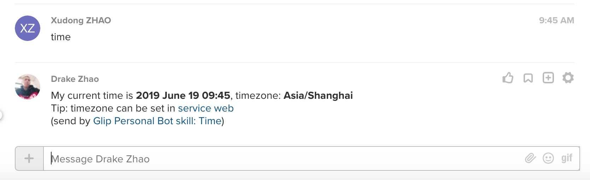

# glip-personal-bot-skill-time

Simple time bot skill for [ringcentral-personal-chatbot-js](https://github.com/ringcentral/ringcentral-personal-chatbot-js) Respond to "time" command with user\'s time and timezone that can be set service web.



## Quick start

First, need create a AWS account, we will use free local AWS dynamodb, and put your aws credentials in `~/.aws/credentials`, check [https://docs.aws.amazon.com/cli/latest/userguide/cli-configure-files.html](https://docs.aws.amazon.com/cli/latest/userguide/cli-configure-files.html)

Let's start a simple chatbot server and login to it with you sandbox glip account, and you account will auto respond to keywords set by you.

```bash
# get the code
git clone git@github.com:rc-personal-bot-framework/glip-personal-bot-skill-time.git
cd glip-personal-bot-skill-time

# install dependecies
npm i

# start proxy server, this will make your local bot server can be accessed by RingCentral service
npm run ngrok

# will show
Forwarding                    https://xxxx.ap.ngrok.io -> localhost:6066
# Remember the https://xxxx.ap.ngrok.io, we will use it later

# start local dynamodb
npm run dynamo
```

Login to [developer.ringcentral.com](https://developer.ringcentral.com/) and create REST API App:

- Application Type: Public
- Platform Type: Browser-based
- Carrier: accept the default values
- Permissions Needed: Accounts, Team messaging, Read Accounts, Webhook Subscriptions
- Set OAuth Redirect URI: Using your ngrok HTTPS URL from above, enter in the following value: `https://xxxx.ap.ngrok.io/rc/oauth`.

```bash
cp .env.sample .env
# then fill all required fields in .env, you can get client ID / secret from app setting

# run sample hello bot
npm start

```

Then visit [https://xxxx.ap.ngrok.io](https://xxxx.ap.ngrok.io) to login, after auth, you can set `Bot skill: FAQ`'s keywords and answers from its setting page. Then try the keywords with another account.

## How to use a bot skill

[https://github.com/rc-personal-bot-framework/ringcentral-personal-chatbot-js/blob/master/docs/write-use-a-skill.md](https://github.com/rc-personal-bot-framework/ringcentral-personal-chatbot-js/blob/master/docs/write-use-a-skill.md)

## Real bot using this skill

[https://github.com/rc-personal-bot-framework/ringcentral-personal-bot-template-js](https://github.com/rc-personal-bot-framework/ringcentral-personal-bot-template-js)

## License

MIT
